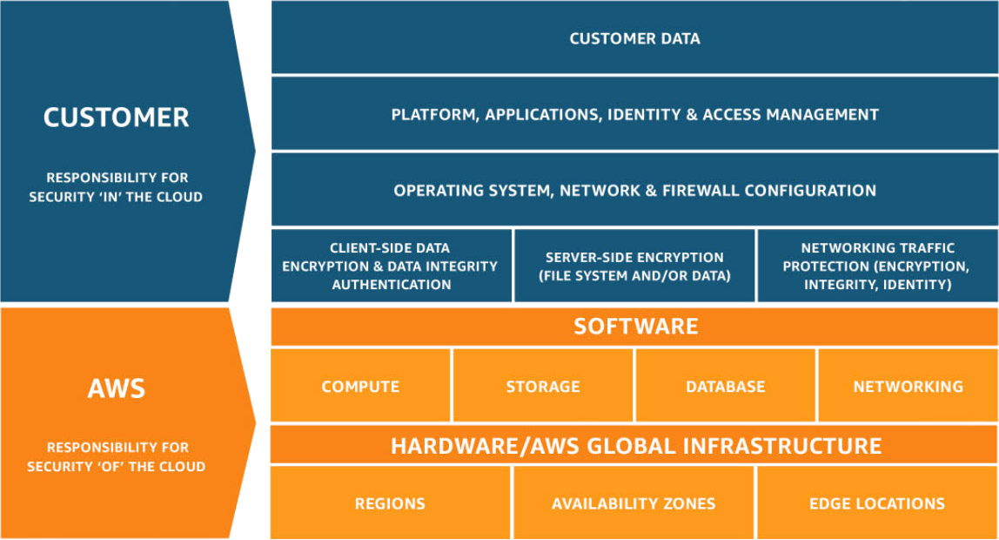

# AWS Certified Cloud Practitioner (CLF-C02) 

## Table of Contents
- [Compute](#compute)
- [Databases](#databases)
- [Business Applications](#business-applications)
- [Management Tools](#management-tools)
- [Cloud Financial Management](#cloud-financial-management)
- [Customer Enablement](#customer-enablement)
- [End User Computing](#end-user-computing)
- [Analytics](#analytics)
- [Application Integration](#application-integration)
- [Containers](#containers)
- [Developer Tools](#developer-tools)
- [Front-End Web & Mobile](#front-end-web--mobile)
- [Internet of Things (IoT)](#internet-of-things-iot)
- [Machine Learning](#machine-learning)
- [Migration & Transfer](#migration--transfer)
- [Networking & Content Delivery](#networking--content-delivery)
- [Security, Identity & Compliance](#security-identity--compliance)
- [Storage](#storage)
- [Blockchain*](#blockchain)
- [Quantum Technologies*](#quantum-technologies)
- [AWS Global Infrastructure Concepts](#aws-global-infrastructure-concepts)
- [AWS Shared Responsibility Model](#aws-shared-responsibility-model)

> `*` Service not included in the official list of services covered by the AWS Certified Cloud Practitioner (CLF-C02) exam.

> `✓` in the **Global** column indicates the service is a Global service, meaning it is not tied to a specific AWS Region (e.g., IAM, Route 53, CloudFront, WAF). Services without a checkmark are Region-scoped: their resources are created and managed within a specific AWS Region. See also [AWS Global Infrastructure Concepts](#aws-global-infrastructure-concepts).

> Note: some services (e.g., **Amazon Machine Image (AMI)**, **Amazon DynamoDB Accelerator (DAX)**, **Amazon WorkSpaces Secure Browser**, **AWS Schema Conversion Tool**) have no dedicated icon in the official AWS icon package; the generic icon of their category is used as a placeholder for these entries.

---

## Compute

| Icon | Service | Global | Description |
| :---: | :--- | :---: | :--- |
|  | [**Amazon Elastic Compute Cloud (EC2)**](https://aws.amazon.com/ec2/) | | Infrastructure as a Service (IaaS) providing resizable virtual machines with flexible OS, CPU, RAM, and storage options; it is fundamental to understanding how the AWS Cloud works.  Beyond the virtual machines themselves, the EC2 ecosystem also covers storing data on virtual drives with **Amazon EBS**, distributing traffic across instances with **Elastic Load Balancing (ELB)**, and automatically scaling capacity with an **Auto Scaling Group (ASG)**.  **Security Groups** act as an instance-level firewall controlling inbound/outbound traffic, while **EC2 User Data** is a bootstrap script run once at first launch to automate instance configuration tasks.  **Instance Types:**<ul><li>General Purpose</li><li>Compute Optimized</li><li>Memory Optimized</li><li>Storage Optimized</li></ul>**Instance Purchasing Options:**<ul><li>On-Demand</li><li>Reserved Instances (Standard & Convertible)</li><li>Savings Plans</li><li>Spot Instances</li><li>Dedicated Hosts</li><li>Dedicated Instances</li><li>Capacity Reservations</li></ul>**Instance Storage:**<ul><li>Amazon EBS</li><li>Amazon Machine Image (AMI)</li><li>EC2 Image Builder</li><li>EC2 Instance Store</li><li>Amazon EFS</li><li>Amazon FSx</li></ul> |
|  | [**AWS Lambda**](https://aws.amazon.com/lambda/) | | Function as a Service (FaaS) to run code on-demand without provisioning or managing underlying servers. |
|  | [**AWS Batch**](https://aws.amazon.com/batch/) | | Managed service to easily run batch processing and distributed computing workloads at any scale. |
|  | [**Amazon EC2 Auto Scaling**](https://aws.amazon.com/ec2/autoscaling/) | | Automatically adds or removes EC2 instances within an Auto Scaling Group (ASG) to dynamically match workload demand, ensuring a minimum/maximum instance count and replacing unhealthy instances.  **Scaling Strategies:**<ul><li>**Manual Scaling** — Update the ASG size manually.</li><li>**Simple / Step Scaling** — Add or remove instances when a CloudWatch alarm is triggered (e.g., CPU > 70%).</li><li>**Target Tracking Scaling** — Keep a target metric (e.g., average CPU) around a set value.</li><li>**Scheduled Scaling** — Adjust capacity ahead of known usage patterns (e.g., every Friday at 5 pm).</li><li>**Predictive Scaling** — Use Machine Learning to forecast traffic and provision capacity in advance.</li></ul> |
|  | [**Amazon Lightsail**](https://aws.amazon.com/lightsail/) | | Easy-to-use virtual private servers, storage, databases, and networking bundled for low-cost, simple application deployment. |
|  | [**Amazon Lightsail for Research**](https://aws.amazon.com/lightsail/research/) | | Simplified cloud research workspaces to run data-intensive analytical applications on powerful virtual computers. |
|  | [**AWS App Runner**](https://aws.amazon.com/apprunner/) | | Managed service to build, deploy, and scale containerized web applications directly from code repositories without infrastructure hassle. |
|  | [**Amazon DCV**](https://aws.amazon.com/hpc/dcv/) | | High-performance remote display protocol that delivers secure streaming of 3D applications and desktops to any device. |
|  | [**Amazon EC2 Image Builder**](https://aws.amazon.com/image-builder/) | | Free service that automates the creation, testing, maintenance, and multi-region distribution of secure EC2 AMIs. |
|  | [**Amazon Machine Image (AMI)**](https://docs.aws.amazon.com/AWSEC2/latest/UserGuide/AMIs.html) * | | Customized template combining an OS, software, and configuration used to launch pre-configured EC2 instances faster, available as public, self-made, or AWS Marketplace images. |
|  | [**AWS Local Zones**](https://aws.amazon.com/about-aws/global-infrastructure/localzones/) | | Infrastructure deployment that places compute, storage, and database services closer to large geographic populations for low-latency access. |
|  | [**AWS Outposts Family**](https://aws.amazon.com/outposts/) | | Fully managed service extending AWS infrastructure, native services, and APIs to on-premises environments for a hybrid cloud experience. |
|  | [**AWS Outposts Rack**](https://aws.amazon.com/outposts/rack/) | | On-premises hybrid infrastructure delivered as a standard form-factor 42U rack to provide local AWS computing and storage. |
|  | [**AWS Outposts Servers**](https://aws.amazon.com/outposts/servers/) | | Compact hybrid cloud compute and storage solutions in 1U or 2U configurations designed for space-constrained locations. |
|  | [**Bottlerocket**](https://aws.amazon.com/bottlerocket/) | | A Linux-based, open-source operating system designed specifically to run containers securely and efficiently. |
|  | [**AWS Parallel Computing Service**](https://aws.amazon.com/pcs/) | | Managed service designed to orchestrate, build, and dynamically scale high-performance computing (HPC) clusters for complex simulations. |
|  | [**AWS Elastic Beanstalk**](https://aws.amazon.com/elasticbeanstalk/) | | Platform as a Service (PaaS) to quickly deploy, scale, and manage web applications without handling the underlying infrastructure. |
|  | [**AWS Compute Optimizer**](https://aws.amazon.com/compute-optimizer/) | | Analysis tool providing rightsizing recommendations for AWS resources to cut operational costs and enhance workload performance. |
|  | [**AWS Parallel Cluster**](https://aws.amazon.com/hpc/parallelcluster/) | | Supported open-source cluster management tool that deploys and configures High Performance Computing (HPC) environments on AWS. |
|  | [**AWS Serverless App Repository (SAR)**](https://aws.amazon.com/serverless/serverlessrepo/) | | Managed repository to easily discover, deploy, and publish serverless applications and components. |
|  | [**AWS Nitro Enclaves**](https://aws.amazon.com/ec2/nitro/nitro-enclaves/) | | Creates isolated compute environments within EC2 instances to protect and process highly sensitive, confidential data. |
|  | [**Elastic Fabric Adapter (EFA)**](https://aws.amazon.com/hpc/efa/) | | Specialized network interface for EC2 instances enabling inter-instance communication at scale for HPC and machine learning workloads. |
|  | [**AWS Wavelength**](https://aws.amazon.com/wavelength/) | | Embeds AWS services within 5G telecom networks to deliver ultra-low latency applications directly to mobile devices. |
|  | **AWS SimSpace Weaver** | | Managed spatial simulation service that runs large-scale, multi-node virtual world environments in the cloud. |
|  | [**Amazon Elastic VMware Service (EVS)**](https://aws.amazon.com/evs/) | | Hybrid service enabling enterprises to natively migrate, run, and scale VMware-based environments directly on AWS infrastructure. |

---

## Databases

| Icon | Service | Global | Description |
| :---: | :--- | :---: | :--- |
|  | [**Amazon RDS**](https://aws.amazon.com/rds/) | | Relational Database Service managing automated provisioning, patching, Point-in-Time backups, Read Replicas, and Multi-AZ deployments; it allows you to create databases in the cloud using the following engines:  <ul><li>PostgreSQL</li><li>MySQL</li><li>MariaDB</li><li>Oracle</li><li>Microsoft SQL Server</li><li>IBM Db2</li><li>Aurora (AWS proprietary database)</li></ul> |
|  | [**Amazon DynamoDB**](https://aws.amazon.com/dynamodb/) | | Fully managed, serverless NoSQL key-value database providing single-digit millisecond latency, auto-scaling, and multi-region Global Tables. |
|  | [**Amazon DynamoDB Accelerator (DAX)**](https://aws.amazon.com/dynamodb/dax/) * | | Fully managed, highly available in-memory cache for DynamoDB, bringing single-digit millisecond latency down to microseconds; unlike Amazon ElastiCache, DAX is exclusively integrated with DynamoDB. |
|  | [**Amazon Aurora**](https://aws.amazon.com/rds/aurora/) | | Cloud-optimized proprietary relational database compatible with PostgreSQL/MySQL, offering auto-scaling storage and an on-demand Serverless tier. |
|  | [**Amazon DocumentDB**](https://aws.amazon.com/documentdb/) | | Fully managed MongoDB-compatible NoSQL database built to easily store, query, scale, and index JSON document data. |
|  | [**Amazon ElastiCache**](https://aws.amazon.com/elasticache/) | | Managed in-memory database service supporting Redis and Memcached to accelerate read-intensive workloads and lower database strain. |
|  | [**Amazon MemoryDB**](https://aws.amazon.com/memorydb/) | | Redis-compatible, durable in-memory database service designed for ultra-fast, microsecond performance and strong data persistence. |
|  | [**Amazon Neptune**](https://aws.amazon.com/neptune/) | | Fully managed, highly available graph database service optimized for rich datasets like social networks and interconnected maps. |
|  | [**Amazon Keyspaces**](https://aws.amazon.com/keyspaces/) | | Scalable, highly available, and managed NoSQL database service compatible with Apache Cassandra workloads. |
|  | [**Amazon Timestream**](https://aws.amazon.com/timestream/) | | Managed, fast, and serverless time-series database designed for IoT tracking, operational analysis, and application monitoring. |
|  | **Oracle Database at AWS** | | Deeply integrated enterprise solution delivering native Oracle database services with high performance inside AWS infrastructure. |
|  | [**AWS Database Migration Service (AWS DMS)**](https://aws.amazon.com/dms/) | | Managed service designed to simplify, accelerate, and securely manage the migration of databases directly into the AWS Cloud. |

---

## Business Applications

| Icon | Service | Global | Description |
| :---: | :--- | :---: | :--- |
|  | [**Amazon Chime**](https://aws.amazon.com/chime/) | | Communications platform providing secure enterprise online meetings, real-time video, text voice chat, and collaboration tools. |
|  | [**Amazon Chime SDK**](https://aws.amazon.com/chime/chime-sdk/) | | Set of real-time communication libraries allowing developers to integrate video, voice, and messaging capabilities into apps. |
|  | [**Amazon Connect**](https://aws.amazon.com/connect/) | | Cloud-based, omnichannel customer contact center service that scales easily to optimize business service interactions. |
|  | [**Amazon Pinpoint**](https://aws.amazon.com/pinpoint/) | | Flexible and scalable outbound/inbound marketing communication service used to engage customers across targeted channels. |
|  | **Amazon Pinpoint APIs** | | Programmatic developer interfaces to coordinate targeted messaging, custom user analytics, and engagement pipelines. |
|  | [**Amazon Quick**](https://aws.amazon.com/quick/) | | Serverless business intelligence service with per-session pricing used to build visualizations and perform ad-hoc analysis. |
|  | [**Amazon Simple-Email-Service (SES)**](https://aws.amazon.com/ses/) | | High-scale, cost-effective transactional and marketing inbound/outbound email cloud service for developers. |
|  | [**Amazon WorkDocs**](https://aws.amazon.com/workdocs/) | | Managed, highly secure enterprise storage and file-sharing service equipped with administrative feedback controls. |
|  | **Amazon WorkDocs SDK** | | Developer toolset allowing custom applications to integrate content collaboration, administrative features, and document actions. |
|  | [**Amazon WorkMail**](https://aws.amazon.com/workmail/) | | Managed, secure business email and shared calendar service supporting desktop and mobile email clients. |
|  | [**AWS AppFabric**](https://aws.amazon.com/appfabric/) | | Connects and aggregates SaaS applications across a corporate framework to enforce consistent security rules and user productivity. |
|  | [**AWS End User Messaging**](https://aws.amazon.com/end-user-messaging/) | | Scalable service enabling businesses to send high-volume, reliable user alerts via SMS, push notifications, and messaging protocols. |
|  | **AWS Supply Chain** | | Cloud application unifying log data with machine learning insights to optimize product delivery and lower supply errors. |
|  | [**AWS Wickr**](https://aws.amazon.com/wickr/) | | Secure enterprise communication workspace offering end-to-end encrypted chat, voice calls, file sharing, and administrative compliance. |

---

## Management Tools

| Icon | Service | Global | Description |
| :---: | :--- | :---: | :--- |
|  | [**Amazon CloudWatch**](https://aws.amazon.com/cloudwatch/) | | Monitoring service used to collect resource metrics, system logs, track operational health, and trigger automated scale alarms. |
|  | [**Amazon Managed Grafana**](https://aws.amazon.com/grafana/) | | Managed deployment of the open-source visualization tool to easily query, alert, and analyze application performance logs. |
|  | [**Amazon Managed Service for Prometheus (AMP)**](https://aws.amazon.com/prometheus/) | | Serverless, container-secure performance monitoring service compatible with the Prometheus querying standard. |
|  | **AWS Application Auto Scaling** | | Programmatic interface providing unified scaling configurations across multiple responsive backend AWS cloud resources. |
|  | [**AWS AppConfig**](https://aws.amazon.com/systems-manager/features/appconfig/) | | Helps developers validate, configure, track, and safely roll out dynamic application updates to target instances. |
|  | [**AWS Auto Scaling**](https://aws.amazon.com/autoscaling/) | | Monitors target business cloud architectures to automatically scale resources horizontally and optimize steady operational performance. |
|  | [**AWS Backint Agent**](https://aws.amazon.com/backint-agent/) | | SAP-certified backup utility designed to stream databases directly between SAP HANA instances and cloud object storage. |
|  | [**AWS Chatbot**](https://aws.amazon.com/chatbot/) | | Interactive monitoring assistant enabling operational teams to receive system alerts and run commands in team chat channels. |
|  | [**AWS CloudFormation**](https://aws.amazon.com/cloudformation/) | | Infrastructure as Code (IaC) tool used to model, provision, deploy, and update global AWS resource stacks using declarative templates. |
|  | [**AWS CloudTrail**](https://aws.amazon.com/cloudtrail/) | | Audit framework tracking internal API actions, infrastructure changes, and user dashboard logins across an AWS account. |
|  | [**AWS Compute Optimizer**](https://aws.amazon.com/compute-optimizer/) | | Analysis tool providing rightsizing recommendations for AWS resources to cut operational costs and enhance workload performance. |
|  | [**AWS Config**](https://aws.amazon.com/config/) | | Evaluates, audits, and records internal resource setups to maintain organization-wide regulatory compliance guidelines. |
|  | [**AWS Console Mobile App**](https://aws.amazon.com/console/mobile/) | | Mobile toolset allowing operational team members to track resources, review alarms, and manage settings on the go. |
|  | [**AWS Control Tower**](https://aws.amazon.com/controltower/) | | Orchestrates the governance setup of secure, multi-account enterprise structures using pre-configured structural landing zones. |
|  | [**AWS DevOps Agent**](https://aws.amazon.com/devops-agent/) | | Internal deployment agent facilitating automated software building pipelines and server deployment orchestration steps. |
|  | [**AWS Distro for OpenTelemetry (ADOT)**](https://aws.amazon.com/otel/) | | Secure distribution tool gathering metrics, traces, and system metadata to feed centralized performance tracking boards. |
|  | [**AWS Health Dashboard**](https://aws.amazon.com/premiumsupport/technology/aws-health/) | ✓ | Informational center detailing service outages, account-specific alarms, and overall regional health updates. |
|  | [**AWS Launch Wizard**](https://aws.amazon.com/launchwizard/) | | Guided sizing, optimization, and resource provisioning assistant for deploying complex enterprise-grade applications. |
|  | [**AWS License Manager**](https://aws.amazon.com/license-manager/) | | Controls and automates software tracking rules to avoid non-compliant usage of external server licenses. |
|  | [**AWS Management Console**](https://aws.amazon.com/console/) | | Unified graphic web portal used to safely look up, manage, and scale global AWS cloud architectures. |
|  | [**AWS Organizations**](https://aws.amazon.com/organizations/) | ✓ | Centralized console to consolidate billing, manage hierarchies, and control governance policies across multiple AWS accounts. |
|  | [**AWS Partner Central**](https://aws.amazon.com/partners/partner-central/) | | Business collaboration platform providing tools, technical certification paths, and resources for verified AWS corporate partners. |
|  | [**AWS Proton**](https://aws.amazon.com/proton/) | | Delivery interface for serverless and container deployments, giving platform engineers automated scaling control. |
|  | [**AWS Resilience Hub**](https://aws.amazon.com/resilience-hub/) | | Central dashboard to assess, audit, and track software application availability parameters and disaster recovery plans. |
|  | [**AWS Resource Explorer**](https://aws.amazon.com/resource-explorer/) | | Search service allowing users to instantly discover resources across accounts using a keyword search index. |
|  | [**AWS Service Catalog**](https://aws.amazon.com/servicecatalog/) | | Central portal managing approved IT cloud architectures, allowing internal teams to deploy compliant templates. |
|  | [**AWS Service Management Connector**](https://aws.amazon.com/service-management-connector/) | | Links AWS cloud provisioning capabilities directly into ITSM software like Jira Service Desk or ServiceNow. |
|  | [**AWS Sustainability**](https://aws.amazon.com/sustainability/) | | Framework guide helping teams optimize data use patterns to achieve carbon footprint reduction and green architecture. |
|  | [**AWS Systems Manager (SSM)**](https://aws.amazon.com/systems-manager/) | | Centralized hub providing secure instance access, configuration automation, and operational patch compliance across hybrid environments. |
|  | [**AWS Telco Network Builder (TNB)**](https://aws.amazon.com/tnb/) | | Automation manager designed to configure, run, and scale virtual telecommunication networks directly on AWS. |
|  | [**AWS Trusted Advisor**](https://aws.amazon.com/premiumsupport/technology/trusted-advisor/) | ✓ | Evaluation engine providing real-time recommendations to enhance data protection, optimize system capacity, and lower costs. |
|  | **AWS User Notifications** | | Aggregation board displaying account operations, system events, and resource state changes across regions. |
|  | **Service Quotas** | | Central console to monitor and request increases for the default limits (quotas) applied to AWS resources and services. |
|  | [**AWS Well-Architected Tool**](https://aws.amazon.com/well-architected-tool/) | | Free self-service tool to review workload architectures against the AWS Well-Architected Framework pillars and best practices. |

---

## Cloud Financial Management

| Icon | Service | Global | Description |
| :---: | :--- | :---: | :--- |
|  | [**AWS Billing Conductor**](https://aws.amazon.com/aws-cost-management/aws-billing-conductor/) | ✓ | Customization dashboard used to reorganize billing views and distribute cost allocations to internal business structures. |
|  | [**AWS Budgets**](https://aws.amazon.com/aws-cost-management/aws-budgets/) | ✓ | Dynamic tracking tool allowing teams to set spending caps and trigger automated alerts when usage outpaces estimates. |
|  | [**AWS Cost and Usage Report (CUR)**](https://aws.amazon.com/aws-cost-management/aws-cost-and-usage-reporting/) | ✓ | Granular data tracking delivery providing detailed analytics regarding exact hourly infrastructure operational metrics. |
|  | [**AWS Cost Explorer**](https://aws.amazon.com/aws-cost-management/aws-cost-explorer/) | ✓ | Analytic modeling panel allowing companies to visualize, forecast, and optimize overall AWS platform expenditures. |
|  | **Reserved Instance Reporting** | ✓ | Analytical tracking panel helping teams inspect, verify, and maximize their active Reserved Instance utilization metrics. |
|  | [**Savings Plans**](https://aws.amazon.com/savingsplans/) | ✓ | Flexible pay-on-demand plan delivering discounted pricing tiers in exchange for a committed hourly infrastructure usage agreement. |
|  | [**AWS Marketplace**](https://aws.amazon.com/marketplace/) | ✓ | Curated digital catalog of third-party software, AMIs, CloudFormation templates, SaaS, and container products deployable on AWS. |

---

## Customer Enablement

| Icon | Service | Global | Description |
| :---: | :--- | :---: | :--- |
|  | [**AWS Activate**](https://aws.amazon.com/activate/) | ✓ | Technical program offering promotional credits, training materials, and support resources designed to help new startups scale. |
|  | [**AWS IQ**](https://aws.amazon.com/iq/) | ✓ | Collaboration network connecting teams with certified third-party cloud experts for technical project consulting. |
|  | [**AWS Managed Services (AMS)**](https://aws.amazon.com/managed-services/) | | Continuous infrastructure operations management for enterprise clients to accelerate cloud adoption. |
|  | [**AWS Professional Services**](https://aws.amazon.com/professional-services/) | ✓ | Global advisory team providing deep technical consulting to help organizations execute cloud deployment objectives. |
|  | [**AWS re:Post**](https://repost.aws/) | ✓ | Community-driven, technical Q&A forum for AWS customers to troubleshoot and learn together. |
|  | **AWS re:Post Private** | ✓ | Enterprise collaboration portal allowing organization members to securely share proprietary technical expertise internally. |
|  | [**AWS Support**](https://aws.amazon.com/premiumsupport/) | ✓ | Structured tier system providing technical operational support, diagnostic tips, and system guidance. |
|  | [**AWS Training & Certification**](https://aws.amazon.com/training/) | ✓ | Professional education platform managing official cloud skills development tracks and technical validation exams. |

---

## End User Computing

| Icon | Service | Global | Description |
| :---: | :--- | :---: | :--- |
|  | [**Amazon WorkSpaces**](https://aws.amazon.com/workspaces/) | | Secure, fully managed cloud virtual desktop infrastructure (VDI) solution designed for remote worker deployment. |
|  | [**Amazon AppStream 2.0**](https://aws.amazon.com/appstream2/) | | Fully managed application streaming service that delivers desktop applications from a web browser without provisioning end-user infrastructure. |
|  | [**Amazon WorkSpaces Secure Browser**](https://aws.amazon.com/workspaces/secure-browser/) † | | Fully managed, browser-based service providing secure, in-context access to internal websites and SaaS applications without a client or agent. |

---

## Analytics

| Icon | Service | Global | Description |
| :---: | :--- | :---: | :--- |
|  | [**Amazon Athena**](https://aws.amazon.com/athena/) | | Serverless interactive query service to analyze data directly in Amazon S3 using standard SQL, with no infrastructure to manage. |
|  | [**Amazon EMR**](https://aws.amazon.com/emr/) | | Managed big data platform to run Hadoop, Apache Spark, HBase, Presto, and Flink clusters for large-scale data processing. |
|  | [**AWS Glue**](https://aws.amazon.com/glue/) | | Serverless data integration service to discover, prepare, and combine data for analytics through extract, transform, and load (ETL) jobs. |
|  | [**Amazon Kinesis**](https://aws.amazon.com/kinesis/) | | Managed service to collect, process, and analyze real-time streaming data at any scale for timely insights. |
|  | [**Amazon OpenSearch Service**](https://aws.amazon.com/opensearch-service/) | | Managed search and analytics engine used to index, search, and visualize large volumes of log and application data. |
|  | [**Amazon Redshift**](https://aws.amazon.com/redshift/) | | Fully managed, petabyte-scale data warehouse service that automatically provisions and scales capacity for analytics workloads. |

---

## Application Integration

| Icon | Service | Global | Description |
| :---: | :--- | :---: | :--- |
|  | [**Amazon EventBridge**](https://aws.amazon.com/eventbridge/) | | Serverless event bus service to route, schedule, and react to events generated by AWS services, SaaS applications, and custom code. |
|  | [**Amazon Simple Notification Service (SNS)**](https://aws.amazon.com/sns/) | | Fully managed publish/subscribe messaging service that fans out notifications from a publisher to multiple subscribers. |
|  | [**Amazon Simple Queue Service (SQS)**](https://aws.amazon.com/sqs/) | | Fully managed message queuing service that decouples and scales microservices, distributed systems, and serverless applications. |
|  | [**AWS Step Functions**](https://aws.amazon.com/step-functions/) | | Serverless visual workflow service to orchestrate Lambda functions and AWS services with sequences, branching, and error handling. |

---

## Containers

| Icon | Service | Global | Description |
| :---: | :--- | :---: | :--- |
|  | [**Amazon Elastic Container Registry (ECR)**](https://aws.amazon.com/ecr/) | | Fully managed private Docker container registry used to store, manage, and deploy container images for ECS, EKS, and Fargate. |
|  | [**Amazon Elastic Container Service (ECS)**](https://aws.amazon.com/ecs/) | | Fully managed container orchestration service to run and scale Docker containers on EC2 instances or on AWS Fargate. |
|  | [**Amazon Elastic Kubernetes Service (EKS)**](https://aws.amazon.com/eks/) | | Managed Kubernetes service to deploy, manage, and scale containerized applications using the open-source Kubernetes engine. |
|  | [**AWS Fargate**](https://aws.amazon.com/fargate/) | | Serverless compute engine for containers that runs ECS or EKS workloads without provisioning or managing underlying EC2 instances. |

---

## Developer Tools

| Icon | Service | Global | Description |
| :---: | :--- | :---: | :--- |
|  | [**AWS Command Line Interface (AWS CLI)**](https://aws.amazon.com/cli/) | | Unified command-line tool to configure and interact directly with AWS service APIs through scriptable commands. |
|  | [**AWS CodeBuild**](https://aws.amazon.com/codebuild/) | | Fully managed build service that compiles source code, runs tests, and produces deployment-ready software packages. |
|  | [**AWS CodePipeline**](https://aws.amazon.com/codepipeline/) | | Continuous delivery orchestration service that automates the build, test, and deploy stages of application release pipelines. |
|  | [**AWS X-Ray**](https://aws.amazon.com/xray/) | | Distributed tracing and debugging service used to analyze and troubleshoot performance issues in production applications. |

---

## Front-End Web & Mobile

| Icon | Service | Global | Description |
| :---: | :--- | :---: | :--- |
|  | [**AWS Amplify**](https://aws.amazon.com/amplify/) | | Set of tools and services to build, deploy, and host scalable full-stack web and mobile applications with built-in CI/CD. |
|  | [**AWS AppSync**](https://aws.amazon.com/appsync/) | | Managed GraphQL service to build APIs that synchronize data across mobile and web apps in real time, with offline support. |

---

## Internet of Things (IoT)

| Icon | Service | Global | Description |
| :---: | :--- | :---: | :--- |
|  | [**AWS IoT Core**](https://aws.amazon.com/iot-core/) | | Managed, scalable service that lets connected IoT devices securely interact with the AWS Cloud and other devices. |

---

## Machine Learning

| Icon | Service | Global | Description |
| :---: | :--- | :---: | :--- |
|  | [**Amazon Comprehend**](https://aws.amazon.com/comprehend/) | | Natural language processing (NLP) service that uses machine learning to uncover insights, sentiment, and relationships in text. |
|  | [**Amazon Kendra**](https://aws.amazon.com/kendra/) | | Intelligent enterprise search service powered by machine learning to find accurate answers across internal documents. |
|  | [**Amazon Lex**](https://aws.amazon.com/lex/) | | Service for building conversational chatbots using the same automatic speech recognition and language understanding as Alexa. |
|  | [**Amazon Polly**](https://aws.amazon.com/polly/) | | Text-to-speech service that uses deep learning to turn written text into lifelike, natural-sounding speech. |
|  | [**Amazon Q**](https://aws.amazon.com/q/) † | | Generative AI-powered assistant that answers questions, troubleshoots issues, and takes action across AWS services and business data. |
|  | [**Amazon Rekognition**](https://aws.amazon.com/rekognition/) | | Computer vision service to detect objects, people, text, and scenes in images and videos using machine learning. |
|  | [**Amazon SageMaker AI**](https://aws.amazon.com/sagemaker/) | | Fully managed service for developers and data scientists to build, train, and deploy machine learning models at scale. |
|  | [**Amazon Textract**](https://aws.amazon.com/textract/) | | Machine learning service to automatically extract text, handwriting, and structured data from scanned documents. |
|  | [**Amazon Transcribe**](https://aws.amazon.com/transcribe/) | | Automatic speech recognition service that converts speech to text using deep learning, with PII redaction support. |
|  | [**Amazon Translate**](https://aws.amazon.com/translate/) | | Neural machine translation service delivering fast, accurate language translation to localize content for global users. |

---

## Migration & Transfer

| Icon | Service | Global | Description |
| :---: | :--- | :---: | :--- |
|  | [**AWS Application Discovery Service**](https://aws.amazon.com/application-discovery/) | | Service that gathers configuration, usage, and dependency data from on-premises data centers to plan cloud migrations. |
|  | [**AWS Application Migration Service (MGN)**](https://aws.amazon.com/application-migration-service/) | | Lift-and-shift (rehost) solution that simplifies migrating physical, virtual, and cloud-based servers to AWS. |
|  | [**AWS Migration Evaluator**](https://aws.amazon.com/migration-evaluator/) | | Service that builds a data-driven business case for migration by analyzing on-premises inventory, usage, and cost. |
|  | [**AWS Migration Hub**](https://aws.amazon.com/migration-hub/) | | Central location to discover, plan, and track the status of application migrations to AWS across multiple tools. |
|  | **AWS Schema Conversion Tool (AWS SCT)** † | | Tool that automatically converts source database schemas and most custom code to a format compatible with the target database engine. |

> Note: [**AWS Database Migration Service (AWS DMS)**](https://aws.amazon.com/dms/), also required for the exam in this area, is already listed in the [Databases](#databases) table.

---

## Networking & Content Delivery

| Icon | Service | Global | Description |
| :---: | :--- | :---: | :--- |
|  | [**Amazon API Gateway**](https://aws.amazon.com/api-gateway/) | | Fully managed service to create, publish, secure, and scale REST, HTTP, and WebSocket APIs for applications. |
|  | [**Amazon CloudFront**](https://aws.amazon.com/cloudfront/) | ✓ | Global content delivery network (CDN) that caches content at edge locations to accelerate delivery and reduce latency. |
|  | [**AWS Direct Connect (DX)**](https://aws.amazon.com/directconnect/) | | Dedicated, private network connection between on-premises infrastructure and AWS offering consistent, low-latency bandwidth. |
|  | [**Elastic Load Balancing (ELB)**](https://aws.amazon.com/elasticloadbalancing/) | | Managed load balancer that distributes incoming application traffic across multiple targets (e.g., EC2 instances) in one or more Availability Zones.  **Load Balancer Types:**<ul><li>**Application Load Balancer (ALB)** — Layer 7 load balancer for HTTP/HTTPS traffic, supporting content-based routing (path, host, headers) across multiple applications and microservices.</li><li>**Network Load Balancer (NLB)** — Layer 4 load balancer for TCP/UDP traffic, providing ultra-high performance and low latency, with support for static/elastic IP addresses.</li><li>**Gateway Load Balancer (GWLB)** — Layer 3 load balancer used to deploy, scale, and manage third-party virtual network appliances (e.g., firewalls, intrusion detection systems).</li><li>**Classic Load Balancer (CLB)** — Legacy load balancer supporting both Layer 4 and Layer 7 traffic, now largely superseded by ALB and NLB.</li></ul> |
|  | [**AWS Global Accelerator**](https://aws.amazon.com/global-accelerator/) | ✓ | Networking service that improves the availability and performance of applications using the AWS global network. |
|  | [**AWS PrivateLink**](https://aws.amazon.com/privatelink/) | | Service providing private connectivity between VPCs, on-premises networks, and AWS services without traversing the public internet. |
|  | [**Amazon Route 53**](https://aws.amazon.com/route53/) | ✓ | Highly available and scalable managed Domain Name System (DNS) with domain registration and health-check-based routing. |
|  | [**AWS Transit Gateway (TGW)**](https://aws.amazon.com/transit-gateway/) | | Network transit hub used to interconnect thousands of VPCs and on-premises networks through a single gateway. |
|  | [**Amazon VPC**](https://aws.amazon.com/vpc/) | | Logically isolated virtual network within AWS where you provision subnets, route tables, and security controls. |
|  | [**AWS Site-to-Site VPN**](https://aws.amazon.com/vpn/site-to-site-vpn/) | | Managed service that creates an encrypted connection between an on-premises network and an Amazon VPC over the public internet. |
|  | [**AWS Client VPN**](https://aws.amazon.com/vpn/client-vpn/) | | Managed client-based VPN service that lets users securely connect to AWS and on-premises networks from any location. |

---

## Security, Identity & Compliance

| Icon | Service | Global | Description |
| :---: | :--- | :---: | :--- |
|  | [**AWS Artifact**](https://aws.amazon.com/artifact/) | ✓ | Self-service portal providing on-demand access to AWS compliance reports and agreements from third-party auditors. |
|  | [**AWS Audit Manager**](https://aws.amazon.com/audit-manager/) † | | Service that continuously audits AWS resource usage to simplify risk assessment and compliance with regulations and standards. |
|  | [**AWS Certificate Manager (ACM)**](https://aws.amazon.com/certificate-manager/) | | Service to provision, manage, and automatically renew public and private SSL/TLS certificates for secure HTTPS connections. |
|  | [**AWS CloudHSM**](https://aws.amazon.com/cloudhsm/) | | Dedicated, single-tenant hardware security module that lets you generate and manage your own encryption keys. |
|  | [**Amazon Cognito**](https://aws.amazon.com/cognito/) | | Identity service for web and mobile apps that manages user sign-up, sign-in, and supports social and federated login. |
|  | [**Amazon Detective**](https://aws.amazon.com/detective/) | | Security service that uses machine learning and graph analysis to investigate and identify the root cause of findings. |
|  | [**AWS Directory Service**](https://aws.amazon.com/directoryservice/) | | Managed Microsoft Active Directory, AD Connector, and Simple AD offerings for directory-based authentication on AWS. |
|  | [**AWS Firewall Manager (FMS)**](https://aws.amazon.com/firewall-manager/) | | Central service to configure and manage WAF rules, Shield protections, and Network Firewall policies across an AWS Organization. |
|  | [**Amazon GuardDuty**](https://aws.amazon.com/guardduty/) | | Intelligent threat detection service that uses machine learning to continuously monitor AWS accounts for malicious activity. |
|  | [**AWS Identity and Access Management (IAM)**](https://aws.amazon.com/iam/) | ✓ | Service to securely manage access to AWS resources through users, groups, roles, and fine-grained policies. Roles are identities with temporary permissions that can be assumed by users or AWS services (e.g., EC2, Lambda) to act on your behalf without long-term credentials; policies are JSON documents that define which actions are allowed or denied on which resources (best practice: grant only the permissions strictly needed, following the principle of least privilege). |
|  | [**AWS IAM Identity Center**](https://aws.amazon.com/iam/identity-center/) | | Single sign-on (SSO) service to centrally manage access across multiple AWS accounts and business applications. |
|  | [**Amazon Inspector**](https://aws.amazon.com/inspector/) | | Automated security assessment service that scans EC2 instances, container images, and Lambda functions for vulnerabilities. |
|  | [**AWS Key Management Service (KMS)**](https://aws.amazon.com/kms/) | | Managed service to create and control cryptographic keys used to encrypt data across AWS services and applications. |
|  | [**Amazon Macie**](https://aws.amazon.com/macie/) | | Data security service that uses machine learning to discover, classify, and protect sensitive data such as PII in S3. |
|  | [**AWS Resource Access Manager (RAM)**](https://aws.amazon.com/ram/) | | Service to securely share AWS resources across accounts, avoiding resource duplication and simplifying management. |
|  | [**AWS Secrets Manager**](https://aws.amazon.com/secrets-manager/) | | Service to securely store, retrieve, and automatically rotate database credentials, API keys, and other secrets. |
|  | [**AWS Security Hub**](https://aws.amazon.com/security-hub/) | | Central dashboard to aggregate, manage, and automate security findings and compliance checks across AWS accounts. |
|  | [**AWS Shield**](https://aws.amazon.com/shield/) | | Managed DDoS protection service, available in a free Standard tier and an advanced paid tier for enhanced protection. |
|  | [**AWS WAF**](https://aws.amazon.com/waf/) | ✓ | Web application firewall that protects web applications and APIs from common exploits using configurable rules. |

---

## Storage

| Icon | Service | Global | Description |
| :---: | :--- | :---: | :--- |
|  | [**AWS Backup**](https://aws.amazon.com/backup/) | | Fully managed service to centrally configure, schedule, and automate backups across AWS services with point-in-time recovery. |
|  | [**Amazon Elastic Block Store (EBS)**](https://aws.amazon.com/ebs/) | | Persistent block-level storage volumes attached to EC2 instances, with **snapshot** and **encryption** support. Volumes are **locked to a single Availability Zone (AZ)** and can only be attached to instances within that same AZ. |
|  | [**Amazon Elastic File System (EFS)**](https://aws.amazon.com/efs/) | | Scalable, fully managed elastic network file system that can be mounted concurrently across multiple EC2 instances and AZs.  **EFS-IA** (Infrequent Access) is a storage class for cost-effective storage of files that are accessed less frequently. |
|  | [**AWS Elastic Disaster Recovery (DRS)**](https://aws.amazon.com/disaster-recovery/) | | Service to quickly and cost-effectively recover physical, virtual, and cloud-based servers into AWS after a disruption. |
|  | [**Amazon FSx**](https://aws.amazon.com/fsx/) | | Managed service to launch and run popular third-party file systems, including Windows File Server, Lustre, NetApp ONTAP, and OpenZFS. |
|  | [**Amazon Simple Storage Service (S3)**](https://aws.amazon.com/s3/) | | Highly durable and scalable object storage service for storing and retrieving any amount of data via buckets.  **Buckets** are always defined at the Region level, even though S3 looks like a global service; bucket naming follows either the **Shared Global Namespace** (a name unique across all AWS accounts and Regions) or the **Account Regional Namespace** (allows reusing the same bucket name across different Regions).  **Objects** are identified by a **key** — the full path made of prefix + object name (e.g. `s3://my-bucket/my_folder/my_file.txt`); S3 has no real concept of directories, only keys containing slashes, although the console UI displays them as folders. Besides their value (the actual data), objects carry:<ul><li>**Metadata** — list of text key/value pairs (system or user-defined) describing the object.</li><li>**Tags** — up to 10 Unicode key/value pairs, useful for security and lifecycle management.</li><li>**Version ID** — assigned to the object only when Versioning is enabled on the bucket.</li></ul>**Security** relies on IAM policies (user-based), Bucket Policies (resource-based, allowing cross-account access), and **Access Control Lists (ACLs)** at the object or bucket level — a finer-grained, legacy mechanism that can be disabled.  S3 can also provide **Static Website Hosting**, serving content directly over HTTP at a bucket-specific website endpoint.  **Replication** asynchronously copies objects between buckets and requires Versioning enabled on both source and destination:<ul><li>**Cross-Region Replication (CRR)** — replicates across different AWS Regions; useful for compliance and lower-latency access.</li><li>**Same-Region Replication (SRR)** — replicates within the same Region; useful for log aggregation or live replication between production and test accounts.</li></ul>**Storage Classes:**<ul><li>**S3 Standard** — General purpose, frequently accessed data, low latency and high throughput.</li><li>**S3 Standard-IA** (Infrequent Access) — Lower cost for less frequently accessed data that still needs rapid retrieval.</li><li>**S3 One Zone-IA** — Same as Standard-IA but stored in a single Availability Zone, at an even lower cost.</li><li>**S3 Glacier Instant Retrieval** — Archive storage with millisecond retrieval, for data accessed about once a quarter.</li><li>**S3 Glacier Flexible Retrieval** — Low-cost archive storage with retrieval times from minutes to hours.</li><li>**S3 Glacier Deep Archive** — Lowest-cost storage class for long-term archiving, with retrieval times of 12-48 hours.</li><li>**S3 Intelligent-Tiering** — Automatically moves objects between access tiers based on usage patterns, with no retrieval fees.</li></ul>**S3 Express One Zone** is a high-performance, single-Availability-Zone storage class (objects stored in a Directory Bucket) delivering single-digit millisecond latency and up to 10x better performance than S3 Standard at a lower cost, ideal for latency-sensitive applications co-located with compute in the same AZ. |
|  | [**Amazon S3 Glacier**](https://aws.amazon.com/s3/storage-classes/glacier/) | | Low-cost Amazon S3 storage classes (Instant, Flexible, and Deep Archive Retrieval) designed for long-term data archiving. |
|  | [**AWS Storage Gateway**](https://aws.amazon.com/storagegateway/) | | Hybrid cloud storage service that connects on-premises environments to AWS storage such as S3, EBS, and Glacier. |
|  | [**AWS Snowball**](https://aws.amazon.com/snow/) | | Highly secure, portable Snowball Edge devices used to migrate up to petabytes of data into and out of AWS and to perform edge computing (running EC2 instances or Lambda functions in locations with limited or no connectivity).  **Snowball Edge Storage Optimized** — device optimized for large-scale data transfer and storage, offering the highest storage capacity (up to 210 TB).  **Snowball Edge Compute Optimized** — device dedicated to edge computing use cases (e.g. data preprocessing, machine learning, media transcoding), trading storage capacity for more compute power. |

---

## Blockchain

| Icon | Service | Global | Description |
| :---: | :--- | :---: | :--- |
|  | [**Amazon Managed Blockchain**](https://aws.amazon.com/managed-blockchain/) | | Managed network deployment engine helping teams build public or private distributed hyperledger architectures. |

---

## Quantum Technologies

| Icon | Service | Global | Description |
| :---: | :--- | :---: | :--- |
|  | [**Amazon Braket**](https://aws.amazon.com/braket/) | | Managed simulation workspace designed to help developers build, validate, and test advanced quantum computing algorithms. |

---

## AWS Global Infrastructure Concepts

AWS services are hosted in multiple locations world-wide, composed of Regions, Availability Zones, Local Zones, and Wavelength Zones. For more details, see [AWS Regions and Availability Zones](https://docs.aws.amazon.com/global-infrastructure/latest/regions/aws-regions-availability-zones.html).

| Identifier | Description |
| :--- | :--- |
| **Region** | A separate geographic area. Each Region is designed to be isolated from the other Regions, achieving the greatest possible fault tolerance and stability. Most AWS services support regional resources: a regional resource is specific to the Region in which it is created, and resources are generally not automatically replicated across Regions. |
| **Availability Zone (AZ)** | An isolated location within a Region. Each Region has multiple, independent Availability Zones connected through low-latency, high-bandwidth, highly-redundant networking over dedicated metro fiber. Each Availability Zone consists of one or more discrete data centers with redundant power, networking, and connectivity, housed in separate facilities, so that a single event (fire, tornado, flooding) only affects one Availability Zone. It is a best practice to deploy applications across multiple Availability Zones for high availability. |
| **Local Zone** | An AWS infrastructure deployment that places compute, storage, database, and other select services closer to large population, industry, and IT centers, enabling low-latency access for end users in that location. |
| **Wavelength Zone** | An AWS infrastructure deployment embedded within telecommunication providers' 5G networks. Wavelength Zones let developers build applications that deliver ultra-low latency to 5G devices and end users by running standard AWS compute and storage services at the edge of the carrier network. |

**See also:** [AWS Global Infrastructure](https://aws.amazon.com/it/about-aws/global-infrastructure/)

---

## AWS Shared Responsibility Model

Security and compliance are a shared responsibility between AWS and the customer. AWS is responsible for **security "of" the Cloud**, while the customer is responsible for **security "in" the Cloud**.

  

| Responsibility | Owner | Scope |
| :--- | :---: | :--- |
| Customer data | Customer | Classifying and managing the data stored and processed in AWS. |
| Platform, applications, identity & access management | Customer | Configuring IAM users, groups, roles, and permissions for applications running on AWS. |
| Operating system, network, and firewall configuration | Customer | Patching the guest OS, configuring security groups and network ACLs. |
| Client-side and server-side data encryption, and network traffic protection | Customer | Encrypting data at rest and in transit, protecting network traffic. |
| Software | AWS | Managing and patching the software that runs the AWS services. |
| Compute, storage, database, networking | AWS | Managing the underlying infrastructure that runs AWS services. |
| Regions, Availability Zones, Edge Locations | AWS | Managing and securing the global physical infrastructure. |

**See also:** [AWS Shared Responsibility Model – Amazon Web Services (AWS)](https://aws.amazon.com/compliance/shared-responsibility-model/)

